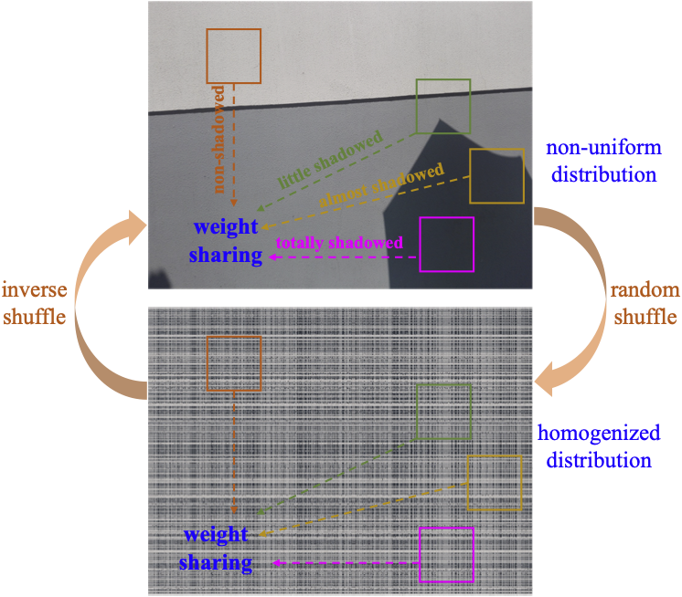

# HomoFormer: Homogenized Transformer for Image Shadow Removal (CVPR 2024)
 <b><a href='https://jiexiaou.github.io'>Jie Xiao</a>, <a href='https://xueyangfu.github.io'>Xueyang Fu</a>, Yurui Zhu, Dong Li, Jie Huang, Kai Zhu, Zheng-Jun Zha</b>

## Method Overview



## Pretrained Model
Pre-trained weights can be found at [this page](https://huggingface.co/jiexiao/HomoFormer).

## train
```
# SRD(HomoFormer) with two 1080Ti GPUs
python train.py --save_dir your_save_dir --train_dir SRD_Train_DIR --val_dir SRD_Test --optimizer adam --env _SRD --arch HomoFormer --batch_size 4 --train_ps 384 
```

## test
```
# SRD(HomoFormer)
python test_M.py --input_dir datapath --weights pretrained_weights --arch HomoFormer --cal_metrics  --result_dir savedir --save_images --gpus 0 --repeat 1 --base_repeat 1
SRD(HomoFormer+)
python test_M.py --input_dir datapath --weights pretrained_weights --arch HomoFormer --cal_metrics  --result_dir savedir --save_images --gpus 0 --repeat 16 --base_repeat 4
ISTDP(HomoFormer)
python test_M.py --input_dir datapath --weights pretrained_weights --arch HomoFormer --cal_metrics  --result_dir savedir --save_images --gpus 0 --repeat 1 --base_repeat 1 --plus
ISTDP(HomoFormer+)
python test_M.py --input_dir datapath --weights pretrained_weights --arch HomoFormer --cal_metrics  --result_dir savedir --save_images --gpus 0 --repeat 16 --base_repeat 4 --plus
```

## Contact
Please contact us if there is any question(ustchbxj@mail.ustc.edu.cn).